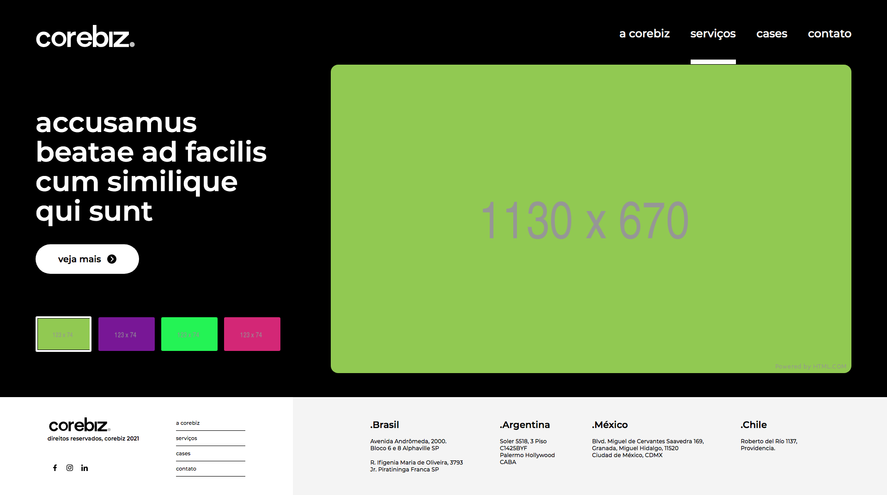
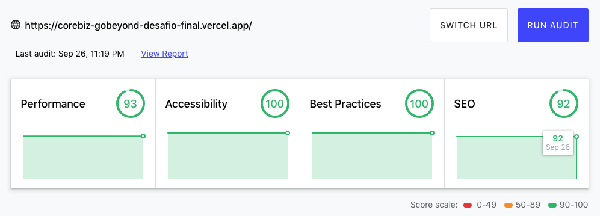

<p align="center">
 
</p>

<h3 align="center">Desafio Final - Go Beyond | Corebiz</h3>

---

## 👀 Preview

[](https://corebiz-gobeyond-desafio-final.vercel.app/) 

### 📊 Lighthouse

[](https://lighthouse-dot-webdotdevsite.appspot.com//lh/html?url=https%3A%2F%2Fcorebiz-gobeyond-desafio-final.vercel.app%2F) 

## 📝 Table of Contents

- [About](#about)
- [How was it done](#how)
    - [Components](#components)
    - [Content API](#api)
    - [Content Slider](#slider)
- [Features](#features)
- [Deployment](#deployment)
- [Authors](#authors)

## 🧐 About   <a name = "about"></a>

Crie uma home page responsiva usando React.

### 🗂 Documentação

- [Descrição do desafio](https://whimsical.com/go-beyond-TcK8nmurXeQmuiFyvwy3Kd)
- [Layout desktop](https://xd.adobe.com/view/e100320d-9539-4cd9-9146-e27f75204e69-b453/?fullscreen)
- [Layout mobile](https://xd.adobe.com/view/e100320d-9539-4cd9-9146-e27f75204e69-b453/screen/02609f96-fe10-4a61-b495-782296f4c193/?fullscreen)
- [Link vercel](https://go-beyond-2021-final-challenge.vercel.app/)

### 🎲 API

Link para pegar as imagens dinâmicas, use essa `https://jsonplaceholder.typicode.com`

## 👩🏻‍💻 How was it done  <a name = "how"></a>

### 🔷 Componentes  <a name = "components"></a>

**[ Header ]**

Utilizem o `hook` `useState` para criar um estado de nome `toggle` e armazenar uma `string` vazia de valor inicial.

Em seguida criei duas funções de nome `handleToggle` e `handleToggleClose` para setar no estado `toggle` os valores `'visible'` e `''` respectivamente.

No retorno `jsx` deste componente criei uma tag `span` contendo `3 hr` para representar o menu `toggle open` e outro `span` contendo `2 hr` para representar o `toggle close`

Na tag `nav` apliquei na classe uma variável para receber do estado `toggle` o valor atribuído conforme a ação de clique dos `span's` que faz a chamada das ações criadas anteriormente.

```tsx
// Estados criados
const [toggle, setToggle] = useState('')
  const handleToggle = () => {
    setToggle('visible')
}
  const handleToggleClose = () => {
    setToggle('')
}

// Menu toggle
<span className="menu__toggle" onClick={handleToggle}>
  <hr />
  <hr />
  <hr />
</span>
<span className="menu__toggle menu__toggle-close" onClick={handleToggleClose}>
  <hr />
  <hr />
</span>
```

E no CSS foi manipulado os `hr's` do `menu__toggle-close` para se transformar em `x`

```scss
.menu__toggle {
    display: flex;
    flex-direction: column;
    gap: .5rem;
    width: 32px;
    height: 30px;

    hr {
      border: thin solid $color-white;
    }

    &.menu__toggle-close {
      position: absolute;
      z-index: 1;
      top: 2rem;
      right: 2rem;

    hr {
      transform: rotate(0) translate(0, 0);
      transition: all 0.2s ease-in-out;
    }
    hr:first-child {
      transform: rotate(45deg) translateX(.45rem);
    }
    hr:last-child {
      transform: rotate(-45deg) translateX(.45rem);
    }
  }
}
```

**[ Footer ]**

Contendo links informativos da **Corebiz**

**[ main ]**

Onde são exibidos os dados da `api`

### 🎲 Dados da API utilizando `axios`  <a name = "api"></a>

Adicionei a dependência `axios` no meu projeto, criei uma função para pegar os dados da `api` 

```bash
yarn add axios
```

```tsx
const getContentAPI = async () => {
    try {
      const response = await axios.get('https://jsonplaceholder.typicode.com/photos', {
        params: {
          _start: 0,
          _limit: 4,
        },
        headers: { 'Cache-Control': 'no-cache' }
      })
      console.log(response)
      setContent(response.data);
    } catch (error) {
      console.log(error);
    }
}
```

### `useEffect`

Utilizei o `hook` `useEffect` para observar as atualizações dessa função

```tsx
useEffect(() => {
    getContentAPI()
}, [])
```

### `useState`

Foram criados 3 `hooks` `useState()` para armazenar os dados da `api` e implementar o `slider` de conteúdo:

```tsx
const [content, setContent] = useState([{
    id: 0,
    title: 'accusamus beatae ad facilis cum similique qui sunt',
    url: 'https://via.placeholder.com/1130x670/92c952',
    thumbnailUrl: 'https://via.placeholder.com/123x74/92c952'
}])
const [index, setIndex] = useState(0)
const [thumbnail, setThumbnail] = useState(0)
```

### 🏞 Slider de conteúdo  <a name = "slider"></a>

Para criar o `slider` alterando o conteúdo de imagem de destaque e título, criei uma `div` e classifiquei como `description__thumbnails` para listar as imagens de `thumbnails` vindas da `api`. Dentro dessa `div`, percorri o estado `content` com o método `map`, setando a `url` vinda da `api` já aplicando a função de adição de parâmetro de medida na `url`, além disso criei uma função anônima ativada pelo `onClick` onde eu passo o `index` recebido deste `map`, armazeno no estado `index` *(criado anteriormente)* e no estado `thumbnail` *(que também foi criado anteriormente)*.

Com isso em uma outra `div` classificada como `content__image`, insiro uma tag image aplicando no `src` a `url` do `index` atual e o título no atributo `alt` desta imagem vinda do estado `content`

E puxo também o título do estado `content` para exibir nesse `slider` de conteúdo

```tsx
// Título
<h1 className="content__title">{content[index].title}
  <a className="content__link" href="https://www.corebiz.ag/" title="Link veja mais para o site da Corebiz">veja mais <span className="hidden">sobre a Corebiz</span></a>
</h1>

// Thumbnails
<div className="description__thumbnails">
  {content.map((item: ContentProps, index: number) => (
     { setIndex(index); setThumbnail(index) }} key={index} width={123} height={74} />
  ))}
</div>

// Imagem de destaque
<div className="content__image">
  
</div>
```

### ✅ I learned   <a name = "learned"></a>

Aparentemente parecia simples realizar este desafio, porém conforme foi seguindo as etapas, os percalços começaram a aparecer, o primeiro deles foi o tamanho da imagem que vem da `API`.

A `url` não vem com parâmetros de medidas, então eu criei uma função para desestruturar a `url` com o `split`, adicionar os parâmetros de medidas que eu desejasse e montar de volta com o `join` substituindo a que vem por padrão.

Url padrão: `https://via.placeholder.com/600/92c952`

```tsx
const addSizeOnUrlImage = (url: string, size: string) => {
  let splitUrl = url.split('/')
  splitUrl[3] = size
  return splitUrl.join('/')
}https://via.placeholder.com/600/92c952
```

Com essa função criada, apliquei nas variáveis de renderização dos elementos de imagem, ex:

```tsx

```

## ✨ Features  <a name = "features"></a>

- [x]  Layout responsivo com menu na versão mobile
- [x]  Requisição de dados da API [Jason Placeholder](https://jsonplaceholder.typicode.com) utilizando `axios`
- [x]  Exibição desse dados da API utilizando o método `map()` para percorrer e listar os elementos conforme a aplicação
- [x]  Função criada para manipular a `url` vinda da `api` e acrescentar parâmetros de medidas
- [x]  Função criada para adicionar e remover classe do CSS para criar o menu mobile
- [x]  Estilização CSS utilizando a propriedade `transform` para manipular o posicionamento dos `hr's` dentro do `menu__toggle-close` com `rotate()` e `translateX()`

## 🚀 Deployment  <a name = "deployment"></a>

Link Vercel: [preview](https://corebiz-gobeyond-desafio-final.vercel.app/)

## ⛏️ Built Using  <a name = "build"></a>

- [React](https://pt-br.reactjs.org/) - Library
- [TypeScript](https://www.typescriptlang.org/pt/) - Types
- [Axios](https://axios-http.com/docs/intro) - API Request
- [Jason Placeholder](https://jsonplaceholder.typicode.com/) - API
- [Sass](https://sass-lang.com/) - Styles

## ✍️ Authors <a name = "authors"></a>
<a href="https://juslenelobeudesigner.com.br/">
  
  <br />
  <sub><b>Juslene Lobeu</b>👩🏻‍💻</sub>
</a>

Feito com&ensp;❤️&ensp;por Juslene Lobeu&ensp;👋🏽&ensp;Entre em contato!

[](https://juslenelobeudesigner.com.br/) 
[](https://www.linkedin.com/in/kjuslenelobeu/) 
[](mailto:juslenelobeu@gmail.com)